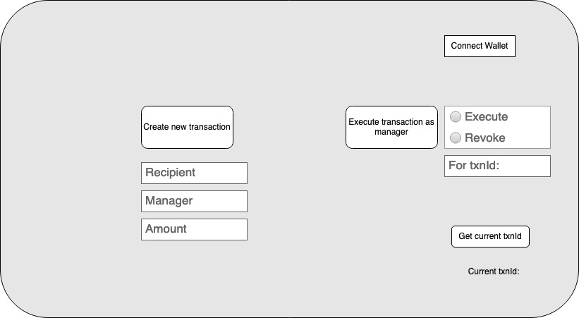
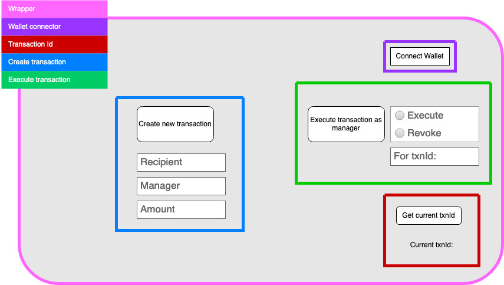

# Ethscrow App

- Url for deployed app: www.ethscrow.xyz
- Contract address: 0xDB32fAd3d0e68B3Da9032729834fb089e17f4632
- Deployed on Ropsten Testnet (https://ropsten.etherscan.io/address/0xDB32fAd3d0e68B3Da9032729834fb089e17f4632)
- App currently only works on the Ropsten Testnet, make sure your metamask is set to Ropsten before interacting with the contract

This is a first dAPP to demonstrate all parts of developing
a dAPP. The result will be a web app that connects to an 
escrow contract on the blockchain. The web app will allow
users to connect their metamask wallet, open escrow
transactions, execute escrow transactions, and view existing
transactions.

The dapp will consist of three major parts:
1. User can create an escrowed transaction, assigning a
manager and a recipient
2. If the user is a manager for a transaction, then that user
can choose to either execute or revoke that transaction by
providing a txnId and their decision (execute or revoke).
3. A user can get the current txnId to see which txnId will
be given for their transaction.

